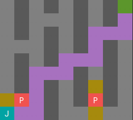

# Solución TP3 AyP2 2c2023

    
   Posible solución (acotada) del TP3 grupal de AyP2.

La solución es acotada porque no se codea la interacción con el usuario. El simulador "se juega solo". 
La dificultad del TP no pasa por recibir y validar inputs del usuario (~~para nada es fiaca...~~) 

El unico método que falta implementar y que merece un comentario es el de "mover a James en un casillero": 
Lo unico que puede ocurrir en ese caso, potencialmente, es que al mover a James se ahuyenta a un Pyramid Head.
La forma en que pensé resolverlo es eliminar ese Pyramid Head al mover a James, luego volver a calcular los
grafos. 

Se equipan armas debiles siempre que sea posible porque se calcula el mejor camino posible, ya sea con un arma equipada
o no.

## Explicación de algunas de las clases importantes:

1. **Tablero**: es la clase que tiene todo el estado del tablero del nivel actual. 
   Esta clase, por heredar de Matriz, ES UNA MATRIZ. Esto significa que se puede acceder a todos los métodos públicos de
   Matriz. De esta forma, se puede manejar desde otras clases como tal, además de tener otros métodos útiles y
   específicos al problema. 
   Esto es un Patrón de diseño llamado [_Decorator_](https://refactoring.guru/design-patterns/decorator), y es muy útil
   para extender una interfaz sin modificar el TDA base (que, generalmente, es un template).
2. **ConversorTablero**: es la clase encargada de, según un tablero, generar grafos que representen el estado
   actual. 
   La idea general es que se parte de una posible representación matricial del problema y se aprovecha eso para generar
   todos los grafos, asociando cada índice bidimensional (i, j) con uno unidimensional de la forma i * col + j. En un
   3x3, (0,0) es 0, (0,1) es 1, (2,2) es 8, etc. 
   De ahi, es facil de entender (creo), que (0,0) conecta con (0,1) y (1,0) pero no con (0,-1) ni (-1,0)...
   Finalmente, teniendo las dimensiones del tablero (matriz), es facil volver de índice unidimensional al bidimensional.
3. **Simulador**: como el nombre indica, es la clase que simula la partida. Es la clase fachada de la solución.